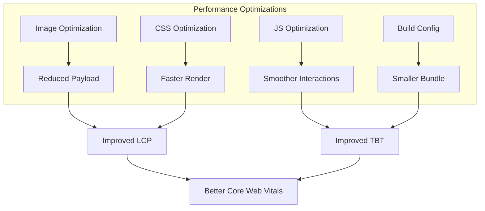

# Design Document: Dashboard Performance Optimization

## Overview

This design addresses critical performance issues identified in the PageSpeed Insights report for the dashboard page. The optimizations target both mobile and desktop experiences, focusing on image delivery, render-blocking resources, forced reflows, and JavaScript efficiency. The implementation will improve Core Web Vitals (LCP, FCP, TBT, CLS) while maintaining the existing visual design and functionality.

## Architecture

The optimization follows a layered approach:

1. **Image Layer**: Optimize Next.js Image component usage with proper sizing, lazy loading, and priority hints
2. **CSS Layer**: Add CSS containment and will-change properties for animation performance
3. **JavaScript Layer**: Debounce event handlers, optimize GSAP usage, and reduce unnecessary re-renders
4. **Build Layer**: Configure Next.js for modern browser targets



## Components and Interfaces

### 1. Dashboard Page Component (`app/dashboard/page.tsx`)

**Changes:**
- Add `priority` prop to first template image for LCP optimization
- Update `sizes` attribute to match actual display dimensions
- Implement debounced resize handler
- Conditionally render blur elements based on viewport
- Memoize static data (navItems, templates)

```typescript
// Debounced resize hook
const useDebouncedResize = (callback: () => void, delay: number) => {
  useEffect(() => {
    let timeoutId: NodeJS.Timeout;
    const handleResize = () => {
      clearTimeout(timeoutId);
      timeoutId = setTimeout(callback, delay);
    };
    window.addEventListener('resize', handleResize, { passive: true });
    return () => {
      clearTimeout(timeoutId);
      window.removeEventListener('resize', handleResize);
    };
  }, [callback, delay]);
};
```

### 2. Dashboard CSS Module (`app/dashboard/dashboard.module.css`)

**Changes:**
- Add `will-change: transform` to animated elements
- Add `contain: layout style paint` for performance isolation
- Ensure aspect-ratio is set on image containers

### 3. GridMotion Component (`components/GridMotion/GridMotion.tsx`)

**Changes:**
- Batch DOM reads before writes to prevent forced reflows
- Add `will-change: transform` to row elements
- Use passive event listeners for mousemove

### 4. Next.js Configuration (`next.config.js`)

**Changes:**
- Configure `browserslist` for modern browsers to reduce polyfills

## Data Models

No new data models required. Existing interfaces remain unchanged:

```typescript
interface Template {
  id: number;
  title: string;
  description: string;
  image: string;
}

interface NavItem {
  id: string;
  label: string;
  icon: string;
  active: boolean;
}
```

## Correctness Properties

*A property is a characteristic or behavior that should hold true across all valid executions of a system-essentially, a formal statement about what the system should do. Properties serve as the bridge between human-readable specifications and machine-verifiable correctness guarantees.*

### Property 1: Resize handler debouncing
*For any* sequence of rapid resize events fired within the debounce delay, the resize callback should execute at most once after the final event.
**Validates: Requirements 3.3**

### Property 2: Component memoization prevents unnecessary re-renders
*For any* parent component re-render where memoized child props remain unchanged, the memoized child component should not re-render.
**Validates: Requirements 5.2**

## Error Handling

| Scenario | Handling Strategy |
|----------|-------------------|
| Image fails to load | Next.js Image component handles gracefully with placeholder |
| Resize handler throws | Wrap in try-catch, log error, continue operation |
| GSAP animation fails | Graceful degradation - elements remain static |
| CSS containment not supported | Progressive enhancement - older browsers get standard rendering |

## Testing Strategy

### Unit Tests
- Verify Image components have correct props (priority, sizes, loading)
- Verify CSS classes include performance optimizations
- Verify event listeners use passive option

### Property-Based Tests
Using Jest with custom property testing:

1. **Debounce Property Test**: Generate random sequences of resize events with varying timing, verify callback execution count matches expected debounce behavior.
   - Tag: **Feature: dashboard-performance-optimization, Property 1: Resize handler debouncing**

2. **Memoization Property Test**: Generate random prop change scenarios, verify re-render counts match memoization expectations.
   - Tag: **Feature: dashboard-performance-optimization, Property 2: Component memoization prevents unnecessary re-renders**

### Integration Tests
- Lighthouse CI to verify Core Web Vitals improvements
- Visual regression tests to ensure no UI changes

### Test Configuration
- Property-based tests should run minimum 100 iterations
- Use Jest's built-in mocking for timing functions
